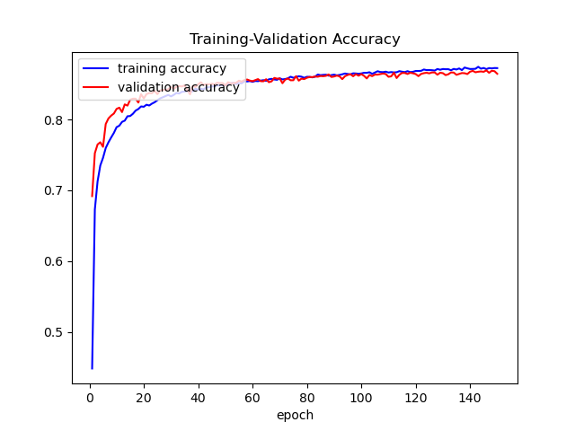
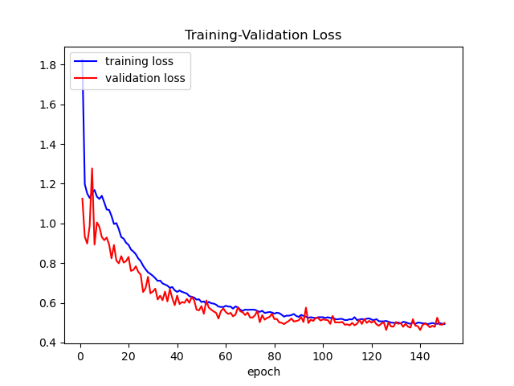

## MultiLayer Perceptron on NumPy

This repository contains a NumPy-based implementation of a multilayer perceptron (MLP). Several of its components can be tuned and played with, such as layer depth and size, hidden and output layer activation functions, weight decay and dropout.

To test my implementation, I make use of dataset `fashion-mnist` [^1], which is automatically downloaded with script `utils.py`. You can build an MLP to perform classification on the Fashion-MNIST dataset. Run `pip install -r requirements.txt` to install the requirements, and then run the command

`python run_fashionMNIST.py --epochs 150 --batch_size 1024 --lr 0.1 --dropout 0.05 --weight_decay 0.00001 -l 512 256 128 64 10`

which will train your MLP with four hidden layers of size `512`, `256`, `128` and `64`, using dropout of $0.05$ and weight decay of , producing accuracy and loss curves such as these ones:

The core implementation of the MLP is found in class `MLP` inside file `MLP.py`.

The model is fitted ('trained') with the traditional backpropagation algorithm. In method `feedforward`, layer activations are computed and stored for later use by `backward`. This method relies on `backprop` to compute the 'residuals' at each layer, and then obtains the gradient at each layer in order to update its weights and biases.

Weight decay is implemented by subtracting a small fraction of the weight matrix to itself before updating it with its gradient. Inverse dropout is performed by masking to 0 a fraction of the activations at each layer. Both of these techniques are designed to avoid overfitting the training set.

[^1]: Fashion-MNIST: a Novel Image Dataset for Benchmarking Machine Learning Algorithms. Han Xiao, Kashif Rasul, Roland Vollgraf. [arXiv:1708.07747](http://arxiv.org/abs/1708.07747)

